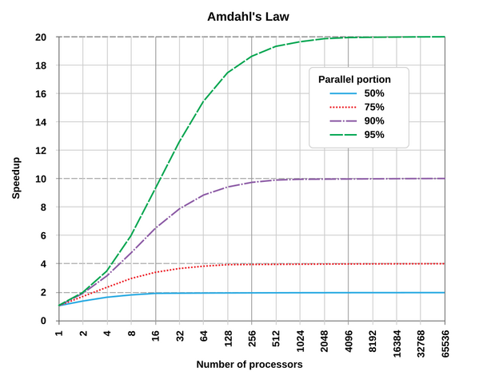

<!-- markdown-toc start - Don't edit this section. Run M-x markdown-toc-refresh-toc -->
**Table of Contents**

- [Intro](#intro)
    - [Chapter goals](#chapter-goals)
    - [Pre-requisites](#pre-requisites)
    - [Three flavours of concurrency](#three-flavours-of-concurrency)
    - [Type representation](#type-representation)
    - [Further reading](#further-reading)
- [Concurrency models](#concurrency-models)
    - [Shared memory](#shared-memory)
        - [Example: state guarded by a mutex](#example-state-guarded-by-a-mutex)
        - [Example: state stored in a concurrent hash map](#example-state-stored-in-a-concurrent-hash-map)
    - [Worker pools](#worker-pools)
        - [Example: parallel matrix multiplication](#example-parallel-matrix-multiplication)
        - [Connection pools](#connection-pools)
    - [Actors](#actors)
        - [How messaging works in the `actix-rt` actor framework (shared memory message queues)](#how-messaging-works-in-the-actix-rt-actor-framework-shared-memory-message-queues)
- [Asynchrony and parallelism](#asynchrony-and-parallelism)
    - [Asynchronous (non-blocking) synchronisation primitives](#asynchronous-non-blocking-synchronisation-primitives)
- [The trouble with concurrency](#the-trouble-with-concurrency)
    - [Correctness](#correctness)
        - [Possible interleaving of events](#possible-interleaving-of-events)
    - [Performance](#performance)
        - [Mutual exclusion](#mutual-exclusion)
        - [Amdahl's law](#amdahls-law)
        - [Shared resource exhaustion](#shared-resource-exhaustion)
        - [False sharing](#false-sharing)
- [Low-level concurrency](#low-level-concurrency)
    - [Memory operations](#memory-operations)
    - [Atomic types](#atomic-types)
    - [Memory ordering](#memory-ordering)
        - [Relaxed ordering](#relaxed-ordering)
        - [Acquire/release ordering](#acquirerelease-ordering)
        - [Acquire/release ordering: corrected example](#acquirerelease-ordering-corrected-example)
        - [Undesirable reordering with Acquire/Release and Relaxed](#undesirable-reordering-with-acquirerelease-and-relaxed)
        - [Sequentially consistent ordering](#sequentially-consistent-ordering)
    - [Compare and exchange](#compare-and-exchange)
    - [The Fetch methods](#the-fetch-methods)
- [Sane concurrency](#sane-concurrency)
    - [Start simple](#start-simple)
    - [Write stress tests](#write-stress-tests)
    - [Use concurrency testing tools](#use-concurrency-testing-tools)
        - [Model checking with Loom](#model-checking-with-loom)
        - [Runtime checking with ThreadSanitizer](#runtime-checking-with-threadsanitizer)
    - [Heisenbugs](#heisenbugs)
- [Summary](#summary)

<!-- markdown-toc end -->

# Intro

## Chapter goals

**Do's:**

- How to add concurrency in `std` Rust programs and libraries
- How to use concurrency primitives correctly

**Dont's:**

- How to implement concurrent data structures
- How to write high-performant code


## Pre-requisites

- experience with concurrent Rust
- basic familiarity with multi-core processor architectures
- basic understanding of concurrency in a desktop OS


## Three flavours of concurrency

1. Single core, single thread: `async/await` - Ch. 8
2. Single core, many threads
3. Many cores (many threads): *true parallelism*.

More flavours, taking OS scheduling and pre-emption into account (*):

- Cooperative multi-tasking
- Pre-emptive multi-tasking

**Terminology**

- Concurrent - acting together while agreeing on something
- Parallel - running without intersections beside one another


## Type representation

- Only one aspect of concurrency: multi-threading
- Thread safety by type checking of `Send` and `Sync` contracts
- Not a compiler feature but a standard library *option*


## Further reading

- Fearless Concurrency in *The Rust Programming Language*:
  - `Send`, `Sync`, locks, smart pointers, channels.
- *Programming Rust* by Blandy, Orendorff and Tindall:
  - hands-on code examples
- [The cost of scalability](https://www.frankmcsherry.org/assets/COST.pdf)
  - how to measure scalability and performance gains


# Concurrency models

Rust has three concurrency models:

 - shared memory concurrency
 - worker pools
 - actors

These are in addition to models managed by the OS:
 - fork-join
 - message passing between OS processes through sockets


## Shared memory

 - state guarded by a mutex
 - state stored in a hash map supporting concurrency, like `RwLock<HashMap>` or `DashMap`
 - can have data- or task-parallelism
 - fits usecases where shared state updates don't commute:
   - if f and g are state update functions, f(g(x)) != g(f(x))
 - locking comes with trade-offs that must be evaluated
   - for example, more concurrent reads but slower writes


### Example: state guarded by a mutex

```rust
fn shared_mem_mutex() -> usize {
    let count = Arc::new(Mutex::new(0));

    let mut handles = vec![];

    for _ in 0..10 {
        let count = Arc::clone(&count);
        let handle = thread::spawn(move || {
            let mut num = count.lock().unwrap();
            *num += 1;
        });
        handles.push(handle);
    }

    for handle in handles {
        handle.join().unwrap();
    }

    let result: MutexGuard<usize> = count.lock().unwrap();
    *result // Deref implementation gets the lock's data
}
```

### Example: state stored in a concurrent hash map

```rust
use dashmap::DashMap;

fn shared_mem_dashmap() -> usize {
    let count = Arc::new(DashMap::new());
    count.insert("value", 0);

    let mut handles = vec![];

    for _ in 0..10 {
        let count = Arc::clone(&count);
        let handle = thread::spawn(move || {
            let mut value = count.get_mut("value").unwrap();
            *value += 1;
        });
        handles.push(handle);
    }

    for handle in handles {
        handle.join().unwrap();
    }

    let result = count.get("value").unwrap();
    *result
}
```


## Worker pools

 - many identical threads receive jobs from a shared job queue
 - jobs are executed independently
 - shared memory is used for the job queue and result collection
 - work stealing - an idle thread can take other thread's job if that hasn't started yet
 - fits SIMD (single instruction, multiple data) applications
 - `rayon`, `tokio` => don't work in `no_std`


### Example: parallel matrix multiplication

```rust
use rayon::iter::{IntoParallelIterator, ParallelIterator};

fn worker_pool_matrix_multiply(a: &[Vec<f64>], b: &[Vec<f64>]) -> Vec<Vec<f64>> {
    let n = a.len();
    let m = b[0].len();
    let p = b.len();

    assert!(
        a[0].len() == p,
        "Matrix dimensions do not match for multiplication!"
    );

    (0..n)
        .into_par_iter()
        .map(|i| {
            (0..m)
                .map(|j| (0..p).map(|k| a[i][k] * b[k][j]).sum())
                .collect()
        })
        .collect()
}
```

### Connection pools

 - a set of established connections that are provided on demand to threads that need connection
 - connection lifecycle management is a complex issue
   - every thread needs to be given a connection with no state from previous users


## Actors

 - many job *actors*
 - one queue for each actor
 - each actor acts on its own job topic and its subset of state
   - database connection
   - file
   - a structure that has to be accessed by many threads
 - message-passing concurrency
   - no locks are required for state management, only for message handling
 - actors don't have to be threads, other options:
   - OS processes communicating via OS sockets
   - Docker containers or Kubernetes pods communicating via HTTP
   - actor executed in it's own worker pool


### How messaging works in the `actix-rt` actor framework (shared memory message queues)

1. **Message Definition**: You define messages, which are plain Rust structs or enums.

```rust
struct Ping;
impl Message for Ping {
    type Result = ();
}
```

2. **Sending a Message**: When an actor sends a message, it calls the `do_send` method on the
   recipient actor’s reference.

```rust
struct PingActor {
    pong: Addr<PongActor>,
}

self.pong.do_send(Ping);
```

3. **Receiving a Message**: When an actor receives a message, the `handle` method of the actor is
   called with the message.

```rust
impl Handler<Ping> for PongActor {
    type Result = ();

    fn handle(&mut self, msg: Ping, ctx: &mut Context<Self>) {
        // Handle the message.
    }
}
```


# Asynchrony and parallelism

When applications need both asynchrony and parallelism, there are suitable futures executors.

 - Futures need to be `Send` to be sent to threads in the worker pool
 - Parallel futures need to be spawned explicitly: executors don't automatically spawn them if they
   are part of a bigger `Future`


## Asynchronous (non-blocking) synchronisation primitives

1. **Mutex**
 - **Type**: `tokio::sync::Mutex`
 - **Usage**: Provides mutual exclusion for data shared between async tasks.

2. **RwLock**
 - **Type**: `tokio::sync::RwLock`
 - **Usage**: Provides asynchronous readers-writer lock.

3. **Semaphore**
 - **Type**: `tokio::sync::Semaphore`
 - **Usage**: Limits the number of concurrent operations.

4. **Notify**
 - **Type**: `tokio::sync::Notify`
 - **Usage**: Notifies one or multiple tasks of an event.

5. **Barrier**
 - **Type**: `tokio::sync::Barrier`
 - **Usage**: allows asynchronous tasks to synchronize, ensuring they await until all tasks reach
   the barrier point.

Other crates to consider: `async-std`, `futures`.

Blocking primitives should be preferred in cases when there is no risk of deadlock because they
don't introduce the polling overhead.


# The trouble with concurrency

## Correctness

**Difficulty #1:** coordinating access to resources

- Concurrent reads are in general simple
- Writes on the other hand can easily lead to *data races*, or *race conditions* more broadly

| Thread 1      | Thread 2      |
|:-------------:|:-------------:|
| x += 1        | x += 1        |

What is the value of x?
Every instruction consists of read, update and write back steps.

### Possible interleaving of events

| Thread 1      | Thread 2      |
|:-------------:|:-------------:|
| read x        |               |
|               | read x        |
| increment     |               |
|               | increment     |
| write x       |               |
|               | write x       |


## Performance

**Linear scalability** ideal: "the performance of the program scales with the number of cores"

In reality, scaling is sublinear... or worse, negative.

**Resource contention**: multiple threads attempt to access a shared resource concurrently.

Resources:

 - CPU cores
 - memory and cache lines
 - IO devices
 - locks and synchronisation primitives
 - drives and network bandwidth

 Consequences of contention:

 - increased latency
 - reduced throughput
 - potential deadlock

Remember simple combinatorics:

**Pigeonhole principle**: If n pigeons fly into m pigeonholes and n > m then at least one pigeonhole
must contain more than one pigeon.


### Mutual exclusion

Mutual exclusion is one of the main solutions to race conditions.

It can also be a cause for contention!

Key concepts:

 - *critical section*: a portion of code that accesses shared resources that can be accessed by at
   most one thread
 - *mutual exclusion*: at most one process can execute within a critical section at a time
 - *synchronisation mechanisms*: those that are used to enforce mutual exclusion, like locks,
   semaphores, monitors and mutexes

Examples:

 - OS or library functions that enforce single-threaded access to a critical section
   - Memory allocator in Rust use to require ME for some allocations
 - Resource dependencies between two parallel calls leading to sequential ordering in the kernel


### Amdahl's law

The speedup of a program from parallelisation is limited by the portion of the program that cannot
be parallelised.

S(N) = 1 / [(1 - P) + P / N]

where:

 - S(N) is the speedup when using N processors.
 - P is the fraction of the program that can be parallelised.
 - (1 - P) is the fraction of the program that is sequential (cannot be parallelised).
 - N is the number of processors.




### Shared resource exhaustion

 - parallel threads vastly exceeding the number of CPU or GPU cores
 - going out of memory
 - causing too many cache misses
 - exceeding maximum IO bandwidth: drives, network, PCIe, etc.

Fixes:

 - optimisation
 - new hardware


### False sharing

Two threads blocking on an entire resource while they use different parts of it.

Fixes:

 - splitting a lock in two, one for each part
 - removing locking of the resource in those threads
 - redesign, such as data structure padding, if the reason is outside the program, like in the
   example below:

**Cache line invalidation**, or **cache line ping-ponging**

Two processors write to different variables that reside on the same cache line. The MESI coherence
protocol still invalidates and transfers the entire cache line, causing unnecessary contention. This
can be mitigated by padding data structures to avoid having frequently written variables share the
same cache line.

1. **Thread A Writes to Cache Line:**
 - If the cache line is in the **Shared** (S) state, the processor must obtain ownership.
 - The cache line transitions to **Modified** (M) or **Exclusive** (E) state.
 - Other processors' caches are invalidated, transitioning their cache lines to the **Invalid** (I)
   state.

2. **Thread B Writes to the Same Cache Line:**
 - If Thread B writes to the same cache line, and it is in Thread A's cache in the **Modified** (M)
   state, an invalidation message is sent to Thread A's cache.
 - Thread A's cache line transitions to the **Invalid** (I) state.
 - Thread B's cache line transitions to the **Modified** (M) or **Exclusive** (E) state after
   obtaining ownership.


# Low-level concurrency

There are a few CPU type primitives in `std::sync::atomic` that all high-level mechanisms discussed
so far rely on.

They can be used in their own right for light-weight cooperation between threads, like

 - incrementing a shared `usize` counter
 - setting a shared Boolean to `true`

These types have well-defined concurrent semantics.


## Memory operations

*Memory* consists of DRAM and a hierarchy of caches. (It *can* include harddrive storage.)

When the program does need to access memory, there are two kinds of CPU memory instructions:
 - *loads*
 - *stores*
with each operating on up to 8 bytes.

*Compiler* makes use of CPU registers for intermediate accesses.

*CPU* pipelines and reorders instructions at execution time to optimise performance.

In parallel contexts, these program transformations can impact application behaviour.

To ensure the desired behaviour, there are multiple load/store instructions, each with own
concurrent semantics.

Rust provides access to those instructions by means of atomic types and their methods.


## Atomic types

 - accessed atomically - loaded or stored all at once
 - size of up to 8 bytes
 - `AtomicUsize`, `AtomicI32`, `AtomicBool`, `AtomicPtr`, ...


## Memory ordering

 - Methods of atomic types take an `Ordering` argument.
 - The CPU only applies program transformations according to that memory ordering.
 - Same semantics as in [C++20 reference](https://en.cppreference.com/w/cpp/atomic/memory_order)
 - *inter-thread synchronization boils down to preventing data races (by establishing happens-before
   relationships) and defining which side effects become visible under what conditions*


### Relaxed ordering

```rust
fn relaxed_ordering() -> (bool, bool) {
    // Shared flags
    let x = Arc::new(AtomicBool::new(false));
    let y = Arc::new(AtomicBool::new(false));

    let t1 = {
        let x = Arc::clone(&x);
        let y = Arc::clone(&y);
        thread::spawn(move || {
            let a = y.load(Ordering::Relaxed);   // 1
            x.store(a, Ordering::Relaxed);       // 2
        })
    };

    let t2 = {
        let x = Arc::clone(&x);
        let y = Arc::clone(&y);
        thread::spawn(move || {
            let _b = x.load(Ordering::Relaxed);  // 3
            y.store(true, Ordering::Relaxed);    // 4
        })
    };

    t1.join().unwrap();
    t2.join().unwrap();

    (x.load(Ordering::Relaxed), y.load(Ordering::Relaxed))
}
```

**Possible values:** `(false, true)` and `(true, true)`


### Acquire/release ordering

 - memory accesses in this thread cannot be moved from after to before an **Acquire** load
 - memory accesses in this thread cannot be moved from before to after a **Release** store
 - all stores in other threads that **Release** (store) a variable are visible in the thread that
   **Acquires** (loads) that variable
 - all stores in the thread that stores a **Release** variable are visible in other threads that
   **Acquire** (load) the same atomic variable

**Fun fact**: Using **Relaxed** ordering on Intel or AMD doesn't introduce a speedup!
 - On **x86** and **x86_64**, Acquire/Release ordering is guaranteed by hardware.


### Acquire/release ordering: corrected example

```rust
fn acqrel_ordering() -> (bool, bool) {
    // Shared flags
    let x = Arc::new(AtomicBool::new(false));
    let y = Arc::new(AtomicBool::new(false));

    let t1 = {
        let x = Arc::clone(&x);
        let y = Arc::clone(&y);
        thread::spawn(move || {
            let a = y.load(Ordering::Acquire);
            x.store(a, Ordering::Release);
        })
    };

    let t2 = {
        let x = Arc::clone(&x);
        let y = Arc::clone(&y);
        thread::spawn(move || {
            let _b = x.load(Ordering::Acquire);
            y.store(true, Ordering::Release);
        })
    };

    t1.join().unwrap();
    t2.join().unwrap();

    (x.load(Ordering::Acquire), y.load(Ordering::Acquire))
}
```


### Undesirable reordering with Acquire/Release and Relaxed

```rust
static X: AtomicBool = AtomicBool::new(false);
static Y: AtomicBool = AtomicBool::new(false);
static Z: AtomicI32 = AtomicI32::new(0);

let t1 = spawn(|| {
    X.store(true, Ordering::Release);
});

let t2 = spawn(|| {
    Y.store(true, Ordering::Release);
});

let t3 = spawn(|| {
    while !X.load(Ordering::Acquire) {}
    if Y.load(Ordering::Acquire) {
        Z.fetch_add(1, Ordering::Relaxed);
    }
});

let t4 = spawn(|| {
    while !Y.load(Ordering::Acquire) {}
    if X.load(Ordering::Acquire) {
        Z.fetch_add(1, Ordering::Relaxed);
    }
});
```

Z can be 1 or 2, or even 0 theoretically (tests haven't confirmed the latter)


### Sequentially consistent ordering

 - the strongest ordering
 - consistent with Acquire/Release plus all threads see the same ordering as one another

**Key takeaways**
 - If in doubt, use `Ordering::SeqCst`.
 - Don't bother about `Ordering::Relaxed` on x86. Use it on ARM and RISC V.


## Compare and exchange

```rust
static LOCK: AtomicBool = AtomicBool::new(false);

fn bad_mutex(f: impl FnOnce()) {
    while LOCK.load(Ordering::Acquire) {   // Wait for the lock to become false
        std::hint::spin_loop();            // Processor hint to a avoid spinning
    }
    LOCK.store(true, Ordering::Release);
    f();                                   // Call f while holding the lock
    LOCK.store(false, Ordering::Release);  // Release the lock
}

fn mutex(f: impl FnOnce()) {
    loop {                                 // Wait for the lock to become false
        let take = LOCK.compare_exchange(
            false,             // current value
            true,              // new value
            Ordering::AcqRel,  // load-modify-store ordering if the comparison succeeds
            Ordering::Relaxed  // load ordering if comparison fails
        );
        match take {
            Ok(false) => break,
            Ok(true) | Err(false) => unreachable!(),
            Err(true) => std::hint::spin_loop(),
        }
    }
    f();                                   // Call f while holding the lock
    LOCK.store(false, Ordering::Release);  // Release the lock
}
```


## The Fetch methods

 - `fetch_add`, `fetch_sub`, `fetch_and`, ...
 - apply a commutative operation to a variable whatever the value of that variable
 - don't require to retry on failure unlike `compare_exchange`
 - still experience a slowdown if more threads fetch the same variable than there are CPUs


# Sane concurrency

Simple life hacks to avoid shooting yourself in the foot.

## Start simple

 - start with the simplest concurrent design you can think of
 - it should be correct, maintainable and measurable
 - example template:
   - multiple threads without internal parallelism
   - communication between threads via channels or shared state with locks
 - use benchmarks to guide code optimisations


## Write stress tests

 - in essence, lots of threads doing simple operations in parallel
 - aim to achieve many possible runtime reorderings of individual operations
 - connection to fuzzing
 - debug assertions are used to identify the faulty code

**Example: concurrent hash map**
 - N threads insert or update keys
 - M threads read keys
 - those N + M threads often choose the same keys


## Use concurrency testing tools

 - tests don't cover all the possible execution traces
 - OS don't provide suitable controls over concurrency flow


### Model checking with Loom

 - Loom deterministically enumerates all posible execution permutations
 - Doesn't fully support SeqCst yet
 - Uses drop-in replacements for types in `std`
 - Can only catch bugs that cause panics

```rust
#[test]
#[should_panic]
fn buggy_concurrent_inc() {
    loom::model(|| {
        let num = Arc::new(AtomicUsize::new(0));
        let ths: Vec<_> = (0..2)
            .map(|_| {
                let num = num.clone();
                thread::spawn(move || {
                    let curr = num.load(Acquire);
                    num.store(curr + 1, Release);
                })
            })
            .collect();
        for th in ths {
            th.join().unwrap();
        }
        assert_eq!(2, num.load(Relaxed));
    });
}
```


### Runtime checking with ThreadSanitizer

 - Automatically adds extra bookkeeping instructions before every memory access
 - Uses an internal state machine to flag any concurrent memory operations with race conditions
 - Documented in the [Unstable Book](https://doc.rust-lang.org/beta/unstable-book/compiler-flags/sanitizer.html)

```rust
static mut A: usize = 0;

fn main() {
    let t = std::thread::spawn(|| {
        unsafe { A += 1 };
    });
    unsafe { A += 1 };

    t.join().unwrap();
}
```

```sh
$ export RUSTFLAGS=-Zsanitizer=thread RUSTDOCFLAGS=-Zsanitizer=thread
$ cargo +nightly run -Zbuild-std --target x86_64-unknown-linux-gnu
```

 - `-Zbuild-std` allows to build the relevant parts of `std` from source

```
WARNING: ThreadSanitizer: data race ...
```


### Heisenbugs

 - a type of software bug that seems to disappear or alter its behavior when one attempts to study
   or debug it
 - common cause: print statements!
   - incur wait times in IO tasks
   - threads that print wait on the same mutex in `std::process:Stdio`, which synchronises them

**Solutions**
 - sanitizers: TSan
 - model checkers: Loom
 - debuggers: gdb, lldb
 - per-thread in-memory log that is printed at the very end
 - logging with a framework: `tracing` by Tokio


# Summary
